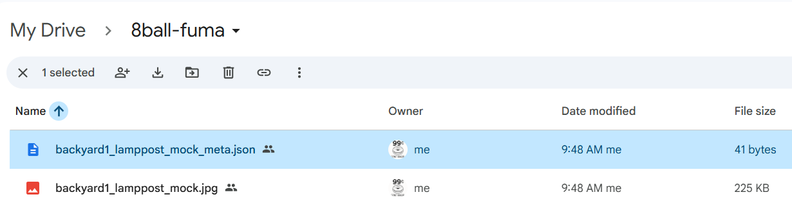

# 8ball-Uploader

cousin project of 8ball-fuma2

| Step | What to change (starting from 8ball-fuma2)                                           | Files / Areas involved                                                                                     | Result in 8ball-uploader                                                                                         |
|------|--------------------------------------------------------------------------------------|-----------------------------------------------------------------------------------------------------------|------------------------------------------------------------------------------------------------------------------|
| 1    | Create new repo `8ball-uploader` from this zip                                       | Git: `git init`, remote to new GitHub repo, first commit as “base from 8ball-fuma2”.                      | Clean separation: uploader evolves without breaking 8ball-fuma2.                                                 |
| 2    | Remove FumaDocs packages from dependencies                                           | `package.json` → remove `fumadocs-core`, `fumadocs-mdx`, `fumadocs-ui`. Optionally remove `@types/mdx`.   | Smaller dependency tree; no FumaDocs install/postinstall overhead.                                               |
| 3    | Remove FumaDocs MDX tooling from Next config                                         | Delete `source.config.ts`. Replace `next.config.mjs` `withMDX(config)` with plain Next config + `images`. | Next runs as a normal app router project; you can still add MDX later if needed via simple `@next/mdx`.         |
| 4    | Replace Root layout & home layout with plain Next components                         | `app/layout.tsx`: remove `RootProvider` import and usage; just render `<body>{children}</body>`.          | No dependency on `fumadocs-ui/provider/next`; layout becomes a standard Next layout.                             |
|      |                                                                                      | Delete/replace `app/(home)/layout.tsx` (remove `HomeLayout` usage).                                       | Home route free from FumaDocs layout; easier to customize uploader dashboard UI.                                |
| 5    | Remove docs-specific FumaDocs routing                                                | Delete `app/docs/layout.tsx` and `app/docs/[[...slug]]/page.tsx`.                                         | `/docs/*` no longer exists as FumaDocs pages; you’ll define uploader routes instead (e.g. `/uploader`).         |
|      |                                                                                      | Delete `app/api/search/route.ts`, `app/llms-full.txt/route.ts`, `app/og/docs/[...slug]/route.tsx`.        | Removes docs search, LLM text export, OG images that depend on `lib/source`.                                     |
| 6    | Remove collection-specific content that only makes sense for FumaDocs                | Delete `content/docs/*` **except** any pieces you still want as plain MD reference (optional).           | 8ball-uploader stops being a general “knowledge vault” and becomes focused on upload/album flows.               |
| 7    | Clean up shared FumaDocs helpers                                                     | Delete `lib/source.ts`, `lib/layout.shared.tsx`, `mdx-components.tsx`.                                    | No dangling imports to `source` or `baseOptions`; repo no longer assumes docs tree.                              |
| 8    | Keep & reuse OAuth as-is (minimal changes)                                           | Keep `auth.js`, `app/api/auth/[...nextauth]/route.js`.                                                    | You retain the working Google OAuth with the same env vars (`GOOGLE_CLIENT_ID`, `GOOGLE_CLIENT_SECRET`, etc.).  |
|      |                                                                                      | Optionally **generalize** the allowed email list later, but leave it as-is for now.                       | 8ball-uploader remains single-user gated initially (good for dev).                                              |
| 9    | Simplify middleware to gate the new uploader route instead of `/docs`                | Edit `middleware.ts`: instead of checking `pathname.startsWith("/docs")`, check `/uploader` or `/album`.  | Auth still enforced, but tied to your new uploader pages rather than FumaDocs docs tree.                        |
|      |                                                                                      | Update sign-in URL callback to your new landing path, e.g. `/uploader`.                                   | After Google sign-in, user lands directly on the uploader dashboard.                                             |
| 10   | Keep and repoint album APIs & UI                                                     | Keep `app/api/album/route.js`, `app/api/album-drive/route.js`, `lib/InfiniteAlbum.tsx`, `lib/InfiniteAlbumDrive.tsx`. | All infinite-scroll behavior is preserved as your “GDrive Gallery” foundation.                                   |
|      |                                                                                      | Create new page, e.g. `app/uploader/page.tsx`, that imports `<InfiniteAlbum />` & `<InfiniteAlbumDrive />`. | You get a simple uploader/gallery screen without FumaDocs — basically a pure NextJS+SWR+Drive viewer.           |
| 11   | Keep Google Drive env pattern unchanged                                              | Keep using `GOOGLE_DRIVE_API_KEY` and `GOOGLE_DRIVE_FOLDER_ID` as currently used in `album-drive` + `remote-page`. | 8ball-uploader can still read from the same Drive folder; later you’ll add upload endpoints to write into it.   |
| 12   | (Later) Add **upload**-specific API routes                                           | Add e.g. `app/api/upload/route.ts` using Google REST or a service account; reuse auth info if needed.     | This becomes the core 8ball-uploader feature while everything else stays slim and Drive-focused.                |

## progress:

OAuth:yes
Email Gated: yes
Upload to Google Drive: yes

## Recent Works

1. **Migration from 8ball-fuma2 → Clean Uploader**  
   Removed all FumaDocs pages, docs routing, OG endpoints, and album viewers.  
   Repo now contains only essential uploader routes and auth logic.

2. **Google OAuth Setup**  
   - Added correct redirect URI: `/api/auth/callback/google`  
   - Enabled Drive scope: `https://www.googleapis.com/auth/drive.file`  
   - Added `99.cent.bagel@gmail.com` as a Google OAuth test user.

3. **NextAuth Configuration**  
   - Converted to `auth.js` (plain JS).  
   - Added Drive access token propagation:
     - `token.accessToken = account.access_token`  
     - `session.accessToken = token.accessToken`  
   - Enforced single-account login via `signIn()` callback.

4. **Middleware Cleanup**  
   Replaced old `/docs` protections with `/uploader` gating.  
   Now only the uploader route requires authentication and allowed email.

5. **Session Debug Endpoint**  
   Added `/api/debug-session` to inspect server-side `auth()` output.  
   Uploader page now shows:
   - Email  
   - Masked Drive Access Token  
   - Full session JSON  

6. **Stable Upload Route**  
   - Rewrote `/api/upload/route.js` with full `try/catch`  
   - Removed `sharp` temporarily for stability  
   - Avoided Node runtime crash (`File instanceof File`)  
   - Ensures all paths return a `NextResponse`  
   - Reliable multipart uploads to Google Drive

7. **Successful Drive Upload**  
   Flow now works correctly:  
   Login → Session token → Pick photo → Upload → File stored in Drive.


## Structure

```
app/
  api/
    upload/route.js          # Upload handler (stable)
    debug-session/route.js   # Session inspection endpoint
    auth/[...nextauth]/route.js
  uploader/page.tsx          # Uploader UI + session info
  page.tsx                   # Login redirect
auth.js                      # NextAuth configuration
middleware.ts                # Protects /uploader
lib/CameraInput.js           # Mobile-friendly camera/file picker
```

## meta.json uploaded
success!
