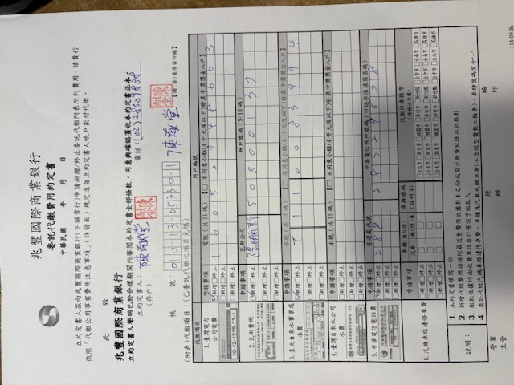
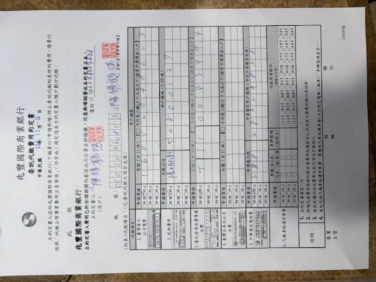
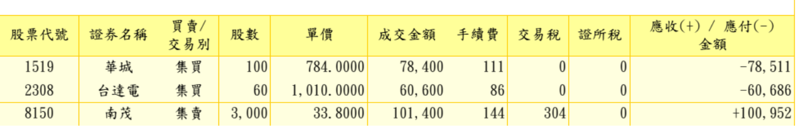

# 兆豐與銀行

> Tags: #銀行 #對帳 #兆豐銀行 #蘭雅分行 #國際兆豐銀行 #存款 #跨國轉帳

---

# 兆豐銀行－帳戶信息
- 全名：國際兆豐銀行－蘭雅分行

- 南犬：010-13-053301 (活-13)

- 南犬：定期存單 010-44-256854（定-44，一年，自動更新，月付利息，提早解除合約 80% 利率） 
  
- 陳楊鶴鳴：01010460813

## 兆豐銀行-帳戶餘額
- 日期： 2025。10。22
- 南犬：(活）46.8萬元 新台幣
- 南犬：（定）25萬元 新台幣  
- 鶴鳴：3萬 新台幣
- 南犬：(證-股票) 32萬9千 新台幣

## APY (annual yield) & Portfolio

(as of 2025.10.22)

| Account       | NTD Amount | APY    |
|---------------|------------|--------|
| 南犬 (活)     | 468,000    | 0.5%   |
| 南犬 (定)     | 250,000    | 1.725% |
| 鶴鳴 (活)     | 30,000     | 0.5%   |
| 南犬 (證-股票) | 329,000    | 3.54%  |


## 兆豐銀行-交易紀錄
- 存入3301：29500 USD（@ exch 30,33 = 89,444 NTD,2025.10.22）， 餘額 724,086
- 購買定存：250K，（一年定，@ 固1.725%, 月付息，到期自動更新），餘額 224,086
- 購買證卷
- 更換印鑑:印章+簽名（南犬）


## 自動扣款：自來水+瓦斯+中華電信
- 停止：陳揚鶴鳴，新增：南犬



## 完成辦理：停止紙張帳單，改成電子
[x] 自來水
[ ] 電話
[ ] 陽明瓦斯

## Mega Bank APP（白+紫色logo）
- 身分證 Yxxx / A xxx
- 用戶名：12427DARK / HOMINYANG (1938.02.15)
- pass: Taipei10 (限八位字) / 同左，或Theo8bal (八位)
- 已經設定 FaceID (iOS)
- 尚待設定：【行動安全碼】（需要台灣註冊的手機門號）
- 未設定：可以享有其它APP功能，但不能轉帳與匯款
- 安全行動：綁定 0972020770 （中華電信-CHT）
- 轉帳：（測試的結果）使用綁定手機（Samsung，SIM卡-上述7700號，啟動4G or 5G(如果國際，必須漫遊)、然後使用兆豐銀行APP（網銀）進行操作

- (網站)https://www.megabank.com.tw/personal
- 【台幣轉帳】 需要Samsung+Celluar Data

```
為何需要台灣（門號）手機？ 防範詐欺，內政部規定綁定ID註冊的門號（雙證件）。

嘗試米國手機，但以失敗告終，無法進行轉帳。

```

## 兆豐行動（證券APP）
- 登錄： Yxxxxx
- pass: T**10 (只8位)
- 已經啟動 FaceID

今天認識新的證業務人員： 
王亞gui（王王）女士， 0910-802-340， lenny_wang@megasec.com.tw

---
11/04交易



| 股票代號 | 名稱  | 股數    | 現價 (NTD) | 總價值 (NTD) | 備註       |
| ---- | --- | ----- | -------- | --------- | -------- |
| 1519 | 華城  | 100   | 784.0    | 78,400    | —        |
| 2308 | 台達電 | 60    | 1,010.0  | 60,600    | —        |
| 2476 | 鉅祥  | 2,000 | 95.0     | 190,000   | 購買價 24.5 |

total: 329,000 (2025.11.5)

## test


> 備註：  
> 本紀錄為個人資產摘要，用於年度財務追蹤與報稅對應。  
> 資料更新時間：2025 年 10 月 21 日。
