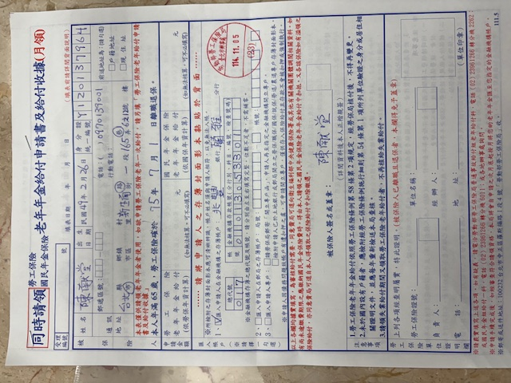
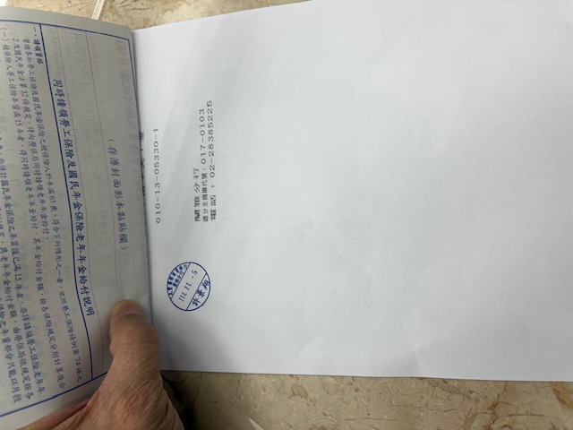
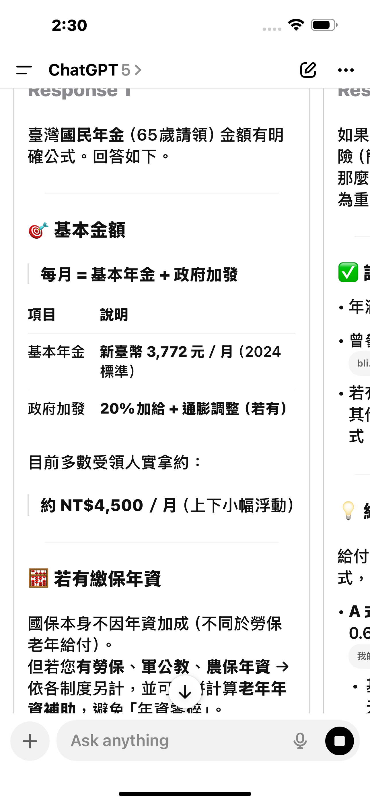

# 勞保（老年給付） + 國民年金（老年給付）

> Tags: 

---

# 2025.11.04（勞保局查詢）

## 勞保年資-試算表
- 海森實業股份有限公司 
- 投保年資：2年01月（1984.06.15 - 1986.07.01)
- 滿65歲"老年給付"：（65歲9月）
- 一次給付：20,184元
- 月付（2900元，沒有書面打印？）

## 國民年金（保險）1：繳費單
- 累計未繳：105,264
- 期間：
  2015.09 - 2022.11
  2022.11 - 2025.02 (滿65)
- 應繳：2025.12.31

## 國民年金（保險）2：無繳費單
- 累計未繳：59,814 (估計)
- 期間：
  2008.12 - 2015.09

## 需要核實：
- 可以補給我？現在是65歲9個月，原本65歲就可以
- 年金1：可否網上銀行轉帳？（我想等2出來再一起繳費）
- 年金2：你們能否加急提供繳費單？
- 勞保老年給付與年金：可以一起領？為何文件說不行？

  ```
  領勞保老年給付，不得參加國民年金...
  ```
- 勞保：月付的金額，能否提供打印版本的估算？ 最低3K 月
- 請幫我核實申請單，OK，已經提交
- 能夠先遞交申請單，再補繳年金嗎
- 我能夠委託太太遞件嗎（需要寫委託書給她嗎？）

## 兆豐
- 總代號是多少？017
- 提供打印，我貼在背後，不要餘額（勞保局不希望保存這樣的信息）

## 11/05 提交申請





## 11/04 國民年金繳費單

使用Alan地址
新生南路一段165巷6之12號
970139001

## GPT 估計
